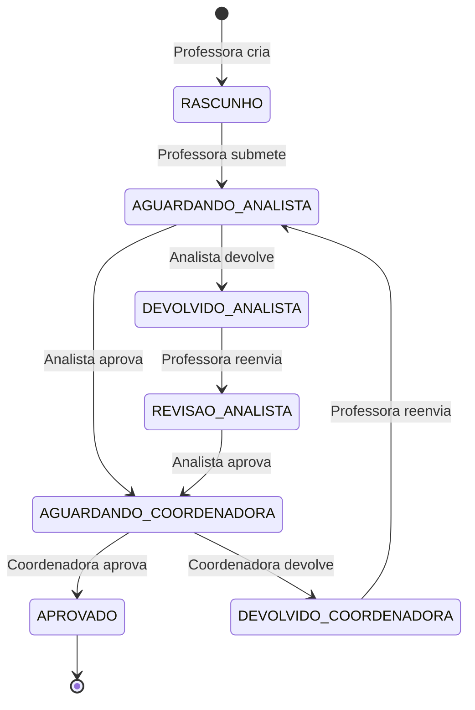

# Database Documentation

Documentacao do banco de dados PostgreSQL e uso do Drizzle ORM no Portal Digital Colegio Essencia Feliz.

---

## Stack

| Tecnologia      | Versao | Uso                      |
| --------------- | ------ | ------------------------ |
| PostgreSQL      | 16     | Banco de dados principal |
| Drizzle ORM     | 0.38.2 | ORM type-safe            |
| Drizzle Kit     | 0.30.1 | Migrations/Studio        |
| Redis           | 7      | Cache e sessoes          |

---

## Visao Geral do Schema

Core (multi-tenant):
- `schools`, `units`, `education_stages`, `unit_stages`
- `users`, `sessions`
- `role_groups`, `role_group_mappings`
- `turmas`, `calendar_events`

Planejamento (Novo):
- `plano_aula_periodo` - Periodos configuraveis por etapa
- `plano_aula` - Planos de aula com periodos flexiveis
- `plano_documento` - Documentos anexados aos planos (ARQUIVO, LINK_YOUTUBE)
- `documento_comentario` - Comentarios de revisao por documento
- `plano_aula_historico` - Rastreamento de mudancas de status
- `quinzena_config` - Configuracao de prazos por quinzena/unidade
- `quinzena_documents` - Documentos legados de quinzena

Tarefas:
- `tarefas` - Tarefas manuais e automaticas
- `tarefa_contextos` - Contexto flexivel por modulo

Planejamento (Legacy):
- `plannings`, `planning_contents`, `planning_reviews`

Shop (CEF Shop):
- `shop_products`, `shop_product_images`, `shop_product_variants`
- `shop_inventory`, `shop_inventory_ledger`
- `shop_orders`, `shop_order_items`
- `shop_interest_requests`, `shop_interest_items`
- `shop_settings`

---

## Tabelas Principais (Core)

### schools

| Coluna | Tipo | Descricao |
| ------ | ---- | --------- |
| `id` | uuid | PK |
| `name` | text | Nome da escola |
| `code` | text | Codigo unico |
| `created_at` | timestamptz | Criacao |
| `updated_at` | timestamptz | Atualizacao |

### units

| Coluna | Tipo | Descricao |
| ------ | ---- | --------- |
| `id` | uuid | PK |
| `school_id` | uuid | FK -> schools.id |
| `name` | text | Nome |
| `code` | text | Codigo |
| `address` | text | Endereco (opcional) |
| `created_at` | timestamptz | Criacao |
| `updated_at` | timestamptz | Atualizacao |

### education_stages

| Coluna | Tipo | Descricao |
| ------ | ---- | --------- |
| `id` | uuid | PK |
| `code` | text | BERCARIO, INFANTIL, FUNDAMENTAL_I, FUNDAMENTAL_II, MEDIO |
| `name` | text | Nome da etapa |

### unit_stages

| Coluna | Tipo | Descricao |
| ------ | ---- | --------- |
| `id` | uuid | PK |
| `unit_id` | uuid | FK -> units.id |
| `stage_id` | uuid | FK -> education_stages.id |
| `is_active` | boolean | Soft delete |

### users

| Coluna | Tipo | Descricao |
| ------ | ---- | --------- |
| `id` | uuid | PK |
| `email` | text | UNIQUE |
| `password_hash` | text | Bcrypt |
| `name` | text | Nome |
| `role` | text | Enum de roles |
| `school_id` | uuid | FK -> schools.id |
| `unit_id` | uuid | FK -> units.id |
| `stage_id` | uuid | FK -> education_stages.id |
| `created_at` | timestamptz | Criacao |
| `updated_at` | timestamptz | Atualizacao |

### sessions

| Coluna | Tipo | Descricao |
| ------ | ---- | --------- |
| `id` | uuid | PK |
| `user_id` | uuid | FK -> users.id |
| `token` | text | UNIQUE |
| `expires_at` | timestamptz | Expiracao |
| `created_at` | timestamptz | Criacao |

### turmas

| Coluna | Tipo | Descricao |
| ------ | ---- | --------- |
| `id` | uuid | PK |
| `unit_id` | uuid | FK -> units.id |
| `stage_id` | uuid | FK -> education_stages.id |
| `professora_id` | uuid | FK -> users.id (opcional) |
| `name` | text | Nome da turma |
| `code` | text | Codigo unico por unidade/ano |
| `year` | integer | Ano letivo |
| `shift` | text | matutino/vespertino/integral |
| `capacity` | integer | Capacidade |
| `is_active` | boolean | Soft delete |

### calendar_events

| Coluna | Tipo | Descricao |
| ------ | ---- | --------- |
| `id` | uuid | PK |
| `unit_id` | uuid | FK -> units.id (obrigatorio) |
| `title` | text | Titulo |
| `description` | text | Descricao (opcional) |
| `event_type` | text | Enum (FERIADO, RECESSO, etc) |
| `start_date` | date | Inicio |
| `end_date` | date | Fim (obrigatorio) |
| `is_school_day` | boolean | Dia letivo |
| `is_recurring_annually` | boolean | Recorrente |
| `created_by` | uuid | FK -> users.id |
| `created_at` | timestamptz | Criacao |
| `updated_at` | timestamptz | Atualizacao |

---

## Planejamento Pedagogico

### plano_aula_periodo

**Armazena períodos configuráveis de planejamento de aulas por etapa educacional.**

| Coluna | Tipo | Descricao |
| ------ | ---- | --------- |
| `id` | uuid | PK |
| `unidade_id` | uuid | FK -> units.id (NOT NULL) |
| `etapa` | text | Etapa educacional (BERCARIO, INFANTIL, FUNDAMENTAL_I, FUNDAMENTAL_II, MEDIO) |
| `numero` | integer | Numero sequencial do periodo na etapa |
| `descricao` | text | Descricao opcional (ex: tema do periodo) |
| `data_inicio` | date | Data de inicio do periodo (NOT NULL) |
| `data_fim` | date | Data de fim do periodo (NOT NULL) |
| `data_maxima_entrega` | date | Prazo de entrega - deve ser antes do inicio (NOT NULL) |
| `criado_por` | uuid | FK -> users.id (usuario que criou o periodo) |
| `criado_em` | timestamptz | Criacao (DEFAULT NOW()) |
| `atualizado_em` | timestamptz | Atualizacao (DEFAULT NOW()) |

**Índices:**
- UNIQUE(unidade_id, etapa, numero) - Garante numeracao unica por etapa
- INDEX(unidade_id) - Buscas por unidade
- INDEX(etapa) - Filtro por etapa
- INDEX(data_inicio, data_fim) - Queries por periodo

**Constraints:**
- `data_inicio < data_fim`
- `data_maxima_entrega < data_inicio`
- Sem sobreposicao de datas na mesma unidade/etapa

**Relações:**
- `plano_aula.plano_aula_periodo_id` FK -> `plano_aula_periodo.id`

### plannings (Legacy)

**NOTA:** Sistema legado de quinzenas fixas. Em migração para `plano_aula_periodo`.

| Coluna | Tipo | Descricao |
| ------ | ---- | --------- |
| `id` | uuid | PK |
| `user_id` | uuid | FK -> users.id |
| `stage_id` | uuid | FK -> education_stages.id (opcional) |
| `turma_id` | text | Codigo da turma |
| `quinzena` | text | Ex: 2025-Q01 |
| `status` | text | Enum planning_status |
| `review_cycles` | integer | Ciclos de review |
| `first_pass_yield` | boolean | Aprovado sem ajustes |
| `created_at` | timestamptz | Criacao |
| `updated_at` | timestamptz | Atualizacao |
| `submitted_at` | timestamptz | Envio |
| `approved_at` | timestamptz | Aprovacao |

### planning_contents

| Coluna | Tipo | Descricao |
| ------ | ---- | --------- |
| `id` | uuid | PK |
| `planning_id` | uuid | FK -> plannings.id (UNIQUE) |
| `objetivos` | text | Texto |
| `metodologia` | text | Texto |
| `recursos` | text | Texto |
| `atividades` | text | Texto |
| `materia` | text | Texto |
| `tema` | text | Texto |
| `habilidades` | text | Texto |
| `conteudos` | text | Texto |
| `avaliacao` | text | Texto |
| `reforco` | text | Texto |
| `anexos` | jsonb | Array de anexos |

### planning_reviews

| Coluna | Tipo | Descricao |
| ------ | ---- | --------- |
| `id` | uuid | PK |
| `planning_id` | uuid | FK -> plannings.id |
| `reviewer_id` | uuid | FK -> users.id |
| `status` | text | Enum review_status |
| `comentario` | text | Obrigatorio |
| `created_at` | timestamptz | Criacao |

### plano_aula

**Sistema atual de planejamento com períodos configuráveis e fluxo de aprovação em dois níveis (analista + coordenadora).**

| Coluna | Tipo | Descricao |
| ------ | ---- | --------- |
| `id` | uuid | PK |
| `user_id` | uuid | FK -> users.id (professora titular, NOT NULL) |
| `turma_id` | uuid | FK -> turmas.id (NOT NULL, CASCADE) |
| `unit_id` | uuid | FK -> units.id (NOT NULL, CASCADE) |
| `plano_aula_periodo_id` | uuid | FK -> plano_aula_periodo.id (opcional, CASCADE) |
| `quinzena_id` | uuid | Identificador da quinzena (NOT NULL) |
| `status` | text | Enum plano_aula_status (default RASCUNHO) |
| `submitted_at` | timestamptz | Data de envio |
| `approved_at` | timestamptz | Data de aprovacao |
| `created_at` | timestamptz | Criacao |
| `updated_at` | timestamptz | Atualizacao |

**Índices:**
- `plano_aula_status_idx` on status
- `plano_aula_quinzena_id_idx` on quinzena_id
- `plano_aula_unit_id_idx` on unit_id
- `plano_aula_user_idx` on user_id
- `plano_aula_periodo_id_idx` on plano_aula_periodo_id
- UNIQUE `plano_aula_user_turma_quinzena_unique` on (user_id, turma_id, quinzena_id)

**Relações:**
- `plano_documento.plano_id` FK -> `plano_aula.id` (documentos anexados)
- `plano_aula_historico.plano_id` FK -> `plano_aula.id` (historico de mudancas)
- `documento_comentario` via `plano_documento` (comentarios por documento)

### plano_documento

**Documentos anexados aos planos de aula (sistema atual). Suporta arquivos e links do YouTube, com conversao automatica para PDF preview.**

| Coluna | Tipo | Descricao |
| ------ | ---- | --------- |
| `id` | uuid | PK |
| `plano_id` | uuid | FK -> plano_aula.id (NOT NULL, CASCADE) |
| `tipo` | text | Enum: ARQUIVO, LINK_YOUTUBE |
| `storage_key` | varchar(500) | Key no storage (para ARQUIVO) |
| `url` | varchar(1000) | URL completa (YouTube ou arquivo publico) |
| `file_name` | varchar(255) | Nome original do arquivo |
| `file_size` | integer | Tamanho em bytes |
| `mime_type` | varchar(100) | Tipo MIME |
| `preview_key` | varchar(500) | Key do PDF convertido no storage |
| `preview_url` | varchar(1000) | URL publica do preview |
| `preview_mime_type` | varchar(100) | Tipo MIME do preview |
| `preview_status` | text | Enum: PENDENTE, PRONTO, ERRO |
| `preview_error` | text | Mensagem de erro |
| `approved_by` | uuid | FK -> users.id (analista que aprovou) |
| `approved_at` | timestamptz | Data da aprovacao |
| `printed_by` | uuid | FK -> users.id (quem imprimiu) |
| `printed_at` | timestamptz | Data da impressao |
| `created_at` | timestamptz | Criacao |
| `updated_at` | timestamptz | Atualizacao |

### quinzena_documents (Legacy)

**NOTA:** Tabela legada para documentos de quinzena do sistema antigo. Mantida para compatibilidade. Para documentos do sistema atual, usar `plano_documento`.

| Coluna | Tipo | Descricao |
| ------ | ---- | --------- |
| `id` | uuid | PK |
| `plano_aula_id` | uuid | FK -> plano_aula.id |
| `arquivo_original` | text | Nome do arquivo original |
| `caminho_pdf` | text | Caminho do PDF convertido |
| `tipo_mime` | text | Tipo MIME original |
| `tamanho` | integer | Tamanho em bytes |
| `uploaded_at` | timestamptz | Data de upload |

### plano_aula_historico

**Rastreamento de mudanças de status com dados denormalizados do usuario para auditoria.**

| Coluna | Tipo | Descricao |
| ------ | ---- | --------- |
| `id` | uuid | PK |
| `plano_id` | uuid | FK -> plano_aula.id (NOT NULL, CASCADE) |
| `user_id` | uuid | FK -> users.id (NOT NULL) |
| `user_name` | text | Nome do usuario (denormalizado, NOT NULL) |
| `user_role` | text | Role do usuario (denormalizado, NOT NULL) |
| `acao` | text | Enum: CRIADO, SUBMETIDO, APROVADO_ANALISTA, DEVOLVIDO_ANALISTA, APROVADO_COORDENADORA, DEVOLVIDO_COORDENADORA, DOCUMENTO_IMPRESSO |
| `status_anterior` | text | Status antes da mudanca |
| `status_novo` | text | Novo status (NOT NULL) |
| `detalhes` | jsonb | Detalhes adicionais (flexivel) |
| `created_at` | timestamptz | Quando a mudanca ocorreu |

### documento_comentario

**Comentarios de revisao vinculados a documentos especificos, com suporte a resolucao.**

| Coluna | Tipo | Descricao |
| ------ | ---- | --------- |
| `id` | uuid | PK |
| `documento_id` | uuid | FK -> plano_documento.id (NOT NULL, CASCADE) |
| `autor_id` | uuid | FK -> users.id (NOT NULL, CASCADE) |
| `comentario` | text | Texto do comentario (NOT NULL) |
| `resolved` | boolean | Status de resolucao (default false) |
| `created_at` | timestamptz | Criacao |

### quinzena_config

**Configuracao de prazos de entrega por quinzena e unidade.**

| Coluna | Tipo | Descricao |
| ------ | ---- | --------- |
| `id` | uuid | PK |
| `unit_id` | uuid | FK -> units.id (NOT NULL, CASCADE) |
| `quinzena_id` | uuid | Identificador da quinzena (NOT NULL) |
| `deadline` | timestamptz | Prazo para entrega (NOT NULL) |
| `created_by` | uuid | FK -> users.id |
| `created_at` | timestamptz | Criacao |
| `updated_at` | timestamptz | Atualizacao |

---

## Tarefas

### tarefas

**Tarefas manuais e automaticas geradas pelo sistema, com controle de prioridade e prazo.**

| Coluna | Tipo | Descricao |
| ------ | ---- | --------- |
| `id` | uuid | PK |
| `school_id` | uuid | FK -> schools.id (NOT NULL) |
| `unit_id` | uuid | FK -> units.id |
| `titulo` | text | Titulo da tarefa (NOT NULL) |
| `descricao` | text | Descricao detalhada |
| `status` | text | Enum: PENDENTE, CONCLUIDA, CANCELADA |
| `prioridade` | text | Enum: ALTA, MEDIA, BAIXA (NOT NULL) |
| `prazo` | timestamptz | Prazo de conclusao (NOT NULL) |
| `criado_por` | uuid | FK -> users.id (NOT NULL) |
| `responsavel` | uuid | FK -> users.id (NOT NULL) |
| `tipo_origem` | text | Enum: AUTOMATICA, MANUAL (NOT NULL) |
| `created_at` | timestamptz | Criacao |
| `updated_at` | timestamptz | Atualizacao |
| `concluida_em` | timestamptz | Data de conclusao |

### tarefa_contextos

**Contexto flexivel vinculado a tarefas, permitindo associacao com diferentes modulos do sistema.**

| Coluna | Tipo | Descricao |
| ------ | ---- | --------- |
| `id` | uuid | PK |
| `tarefa_id` | uuid | FK -> tarefas.id (NOT NULL, CASCADE) |
| `modulo` | text | Enum: PLANEJAMENTO, CALENDARIO, USUARIOS, TURMAS, LOJA |
| `quinzena_id` | varchar(10) | Identificador de quinzena |
| `etapa_id` | uuid | FK -> education_stages.id |
| `turma_id` | uuid | FK -> turmas.id |
| `professora_id` | uuid | FK -> users.id |

---

## CEF Shop (Loja)

### shop_products

Campos principais: `school_id`, `name`, `description`, `image_url`, `base_price`, `category`, `is_active`.

### shop_product_images

Campos principais: `product_id`, `image_url`, `display_order`.

### shop_product_variants

Campos principais: `product_id`, `size`, `sku`, `price_override`, `is_active`.

### shop_inventory

Campos principais: `variant_id`, `unit_id`, `quantity`, `reserved_quantity`, `low_stock_threshold`.

### shop_inventory_ledger

Campos principais: `inventory_id`, `movement_type`, `quantity_change`, `reference_id`, `notes`, `created_by`, `created_at`.

### shop_orders

Campos principais: `school_id`, `unit_id`, `order_number`, `status`, `order_source`, `customer_*`, `total_amount`, `installments`, `payment_method`, `stripe_payment_intent_id`, `expires_at`, `paid_at`, `picked_up_at`, `cancelled_at`.

### shop_order_items

Campos principais: `order_id`, `variant_id`, `student_name`, `quantity`, `unit_price`.

### shop_interest_requests

Campos principais: `school_id`, `unit_id`, `customer_*`, `student_*`, `notes`, `contacted_at`, `contacted_by`.

### shop_interest_items

Campos principais: `interest_request_id`, `variant_id`, `quantity`.

### shop_settings

Campos principais: `unit_id`, `max_installments`, `is_shop_enabled`, `pickup_instructions`.

---

## Enums

### planning_status (Legacy)

`RASCUNHO`, `PENDENTE`, `EM_AJUSTE`, `APROVADO`

### review_status (Legacy)

`APROVADO`, `EM_AJUSTE`

### plano_aula_status

`RASCUNHO`, `AGUARDANDO_ANALISTA`, `AGUARDANDO_COORDENADORA`, `DEVOLVIDO_ANALISTA`, `DEVOLVIDO_COORDENADORA`, `REVISAO_ANALISTA`, `APROVADO`

**Fluxo de aprovacao em dois niveis:**



### education_stage_enum

`BERCARIO`, `INFANTIL`, `FUNDAMENTAL_I`, `FUNDAMENTAL_II`, `MEDIO`

### shop enums

- `productCategoryEnum`: `UNIFORME_DIARIO`, `UNIFORME_EDUCACAO_FISICA`, `ACESSORIO`
- `orderStatusEnum`: `AGUARDANDO_PAGAMENTO`, `PAGO`, `RETIRADO`, `CANCELADO`, `EXPIRADO`
- `orderSourceEnum`: `ONLINE`, `PRESENCIAL`
- `paymentMethodEnum`: `PIX`, `CARTAO_CREDITO`, `CARTAO_DEBITO`, `DINHEIRO`
- `movementTypeEnum`: `ENTRADA`, `VENDA_ONLINE`, `VENDA_PRESENCIAL`, `AJUSTE`, `RESERVA`, `LIBERACAO`

### planejamento enums (novos)

- `documentoTipoEnum`: `ARQUIVO`, `LINK_YOUTUBE`
- `documentoPreviewStatusEnum`: `PENDENTE`, `PRONTO`, `ERRO`
- `planoAulaHistoricoAcaoEnum`: `CRIADO`, `SUBMETIDO`, `APROVADO_ANALISTA`, `DEVOLVIDO_ANALISTA`, `APROVADO_COORDENADORA`, `DEVOLVIDO_COORDENADORA`, `DOCUMENTO_IMPRESSO`

### tarefas enums

- `tarefaStatusEnum`: `PENDENTE`, `CONCLUIDA`, `CANCELADA`
- `tarefaPrioridadeEnum`: `ALTA`, `MEDIA`, `BAIXA`
- `tarefaTipoOrigemEnum`: `AUTOMATICA`, `MANUAL`
- `tarefaContextoModuloEnum`: `PLANEJAMENTO`, `CALENDARIO`, `USUARIOS`, `TURMAS`, `LOJA`

---

## Drizzle ORM

### Estrutura de Arquivos

```
packages/db/src/schema/
  calendar-events.ts
  education-stages.ts
  planejamento.ts            # Legacy (plannings, planning_contents, planning_reviews)
  plano-aula.ts              # Novo sistema (plano_aula, plano_documento, documento_comentario)
  plano-aula-periodo.ts      # Periodos configuraveis por etapa
  plano-aula-historico.ts    # Historico de acoes no plano
  quinzena-documents.ts      # Documentos legados de quinzena
  tarefas.ts                 # Tarefas e contextos (tarefas, tarefa_contextos)
  role-groups.ts
  schools.ts
  sessions.ts
  shop.ts
  shop-relations.ts
  turmas.ts
  turmas-relations.ts
  unit-stages.ts
  units.ts
  users.ts
```

### Comandos

```bash
pnpm db:generate   # gerar migracao
pnpm db:migrate    # aplicar migracoes
pnpm db:studio     # Drizzle Studio
```

---

## Doc Drift (Pendencias)

- `shop_interest_requests.status` e usado nos services do Shop, mas nao existe no schema atual (`packages/db/src/schema/shop.ts`). Necessita migration ou ajuste no service.

## Migração em Andamento

**Sistema de Planejamento (2026-01):**

Sistema **Legacy** (quinzenas fixas):
- `plannings`, `planning_contents`, `planning_reviews`
- Quinzenas hardcoded no código (Q01-Q24)
- Sem flexibilidade por etapa educacional

Sistema **Novo** (períodos configuráveis):
- `plano_aula_periodo` - Períodos configurados por coordenadora
- `plano_aula` - Planos vinculados a períodos e quinzenas
- `plano_documento` - Documentos com preview automatico e aprovacao por analista
- `documento_comentario` - Feedback por documento com resolucao
- `plano_aula_historico` - Auditoria completa com dados denormalizados
- `quinzena_config` - Prazos configuráveis por quinzena/unidade

Sistema **Tarefas**:
- `tarefas` - Tarefas manuais e automaticas com prioridade e prazo
- `tarefa_contextos` - Contexto flexivel vinculado a modulos do sistema

**Status:**
- ✅ Migration 0012 aplicada em produção
- ✅ API `/plano-aula-periodos` implementada
- ✅ Interface da coordenadora implementada
- ⚠️ Interface da professora em desenvolvimento
- ⚠️ Sistema legado ainda em uso (coexistência temporária)

---

## Governanca

**`packages/db` so pode ser importado por `services/api`**.

```
App (Next.js) -> HTTP -> API (NestJS) -> Drizzle -> PostgreSQL
```
