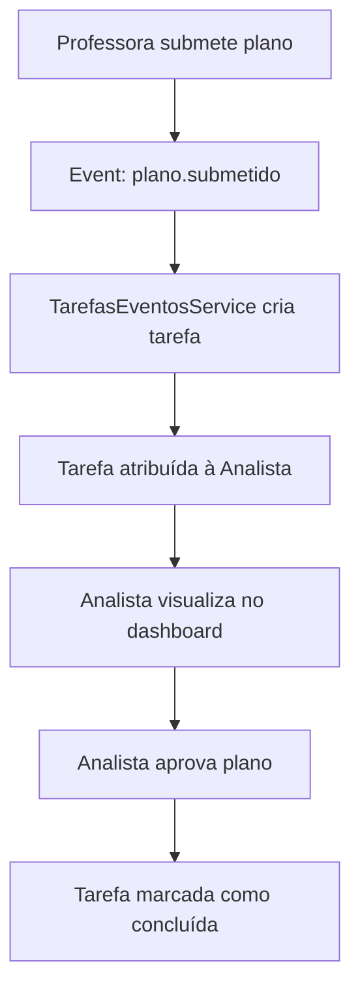
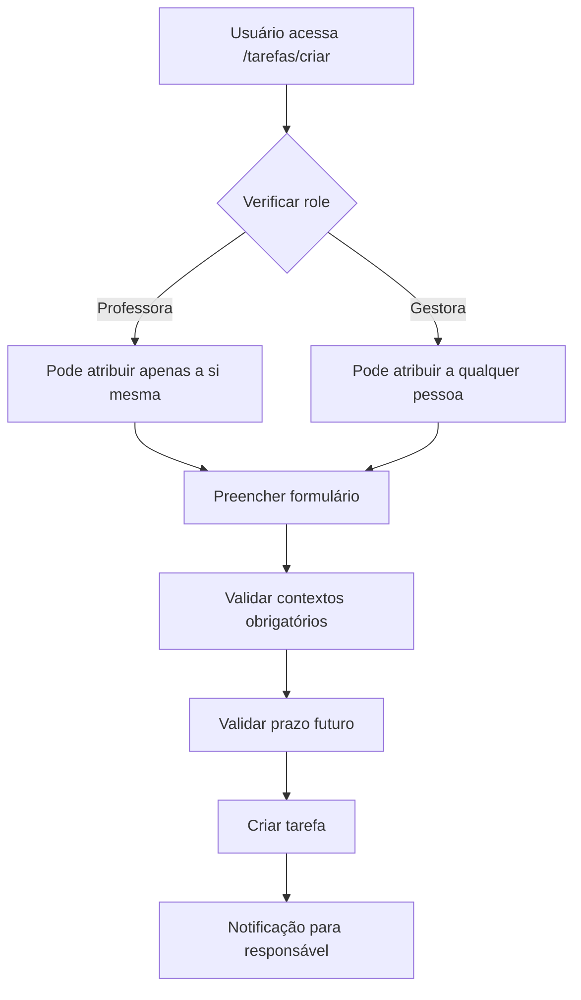

# Sistema de Tarefas e Histórico

## Visão Geral

Sistema de gerenciamento de tarefas integrado ao Portal CEF, com suporte a tarefas automáticas baseadas em workflow e criação manual com contextos estruturados.

## Funcionalidades

- ✅ Tarefas automáticas criadas no workflow de planejamento
- ✅ Criação manual de tarefas com contextos ricos
- ✅ Visualização: "Criadas por mim" + "Atribuídas a mim"
- ✅ Notificações in-app para tarefas atrasadas/urgentes
- ✅ Widgets reutilizáveis para outros módulos
- ✅ Histórico de ações em planos de aula

## Arquitetura

### Backend

- **Módulo**: `services/api/src/modules/tarefas`
- **Tabelas**: `tarefas`, `tarefa_contextos`, `plano_aula_historico`
- **Eventos**: `plano.submetido`, `plano.aprovado_analista`, etc.

### Frontend

- **App**: `apps/tarefas` (porta 3012)
- **Widgets**: Reutilizáveis em outros apps
- **Rotas**:
  - `/tarefas` - Dashboard principal
  - `/tarefas/criar` - Criar tarefa
  - `/tarefas/[id]` - Detalhes da tarefa

## API Endpoints

### Tarefas

```
GET    /api/tarefas                  # Listar tarefas
POST   /api/tarefas                  # Criar tarefa manual
GET    /api/tarefas/:id              # Buscar tarefa
PATCH  /api/tarefas/:id/concluir     # Concluir tarefa
GET    /api/tarefas/stats/resumo     # Estatísticas
```

### Histórico

```
GET    /api/plano-aula/:id/historico  # Histórico de um plano
```

## Permissões

| Role | Criar | Atribuir | Visualizar | Concluir |
|------|-------|----------|------------|----------|
| Professora | ✅ | Si mesma | Criadas/Atribuídas | Atribuídas |
| Analista | ✅ | Qualquer (unidade) | Criadas/Atribuídas | Atribuídas |
| Coordenadora | ✅ | Qualquer (segmento) | Criadas/Atribuídas | Atribuídas |
| Gerente/Diretora | ✅ | Qualquer (unidade/escola) | Todas | Atribuídas |

## Contextos Obrigatórios por Role

| Role | Contextos Obrigatórios |
|------|------------------------|
| Professora | módulo, quinzenaId |
| Analista+ | módulo, quinzenaId, etapaId, turmaId, professoraId |

## Widgets Reutilizáveis

### TarefaBadge

Badge de notificação com contador de tarefas pendentes/atrasadas.

```typescript
import { TarefaBadge } from "@/../../tarefas/features/widgets/tarefa-badge";

<TarefaBadge />
```

**Localização**: Integrado no sidebar global ([packages/components/src/shell/app-sidebar.tsx](../packages/components/src/shell/app-sidebar.tsx))

### TarefasPendentesWidget

Widget de listagem de tarefas urgentes.

```typescript
import { TarefasPendentesWidget } from "@/../../tarefas/features/widgets/tarefas-pendentes-widget";

<TarefasPendentesWidget modulo="planejamento" quinzenaId="..." />
```

**Localização**: Dashboard de gestão ([apps/planejamento/app/gestao/dashboard-content.tsx](../apps/planejamento/app/gestao/dashboard-content.tsx))

### HistoricoTimeline

Componente de timeline visual para exibir histórico de ações em planos de aula.

```typescript
import { HistoricoTimeline } from "@/features/plano-aula/components/historico-timeline";

<HistoricoTimeline planoId="..." />
```

**Localizações**:
- Página de revisão da analista (sidebar)
- Página de revisão da coordenadora (sidebar)
- Página de visualização da professora (aba "Histórico")

## Desenvolvimento

### Rodar localmente

```bash
# Backend
pnpm --filter=api dev

# Frontend - App Tarefas
pnpm --filter=tarefas dev

# Frontend - App Planejamento
pnpm --filter=planejamento dev
```

### Testes

```bash
# Unit tests - Histórico
pnpm test -- plano-aula-historico.service.spec.ts

# Unit tests - Tarefas
pnpm test -- tarefas.service.spec.ts

# Todos os testes da API
pnpm --filter=api test
```

## Estrutura de Dados

### Tabela: tarefas

| Campo | Tipo | Descrição |
|-------|------|-----------|
| id | UUID | Identificador único |
| schoolId | UUID | Escola (tenant) |
| unitId | UUID (nullable) | Unidade específica |
| titulo | VARCHAR | Título da tarefa |
| descricao | TEXT (nullable) | Descrição detalhada |
| status | ENUM | PENDENTE, CONCLUIDA, CANCELADA |
| prioridade | ENUM | BAIXA, MEDIA, ALTA |
| prazo | TIMESTAMP | Data/hora limite |
| criadoPor | UUID | Usuário criador |
| responsavel | UUID | Usuário responsável |
| tipoOrigem | ENUM | MANUAL, AUTOMATICA |
| concluidaEm | TIMESTAMP (nullable) | Data de conclusão |

### Tabela: tarefa_contextos

| Campo | Tipo | Descrição |
|-------|------|-----------|
| id | UUID | Identificador único |
| tarefaId | UUID | Referência à tarefa |
| modulo | ENUM | PLANEJAMENTO, CALENDARIO, etc. |
| quinzenaId | VARCHAR (nullable) | ID da quinzena |
| etapaId | UUID (nullable) | ID da etapa educacional |
| turmaId | UUID (nullable) | ID da turma |
| professoraId | UUID (nullable) | ID da professora |

### Tabela: plano_aula_historico

| Campo | Tipo | Descrição |
|-------|------|-----------|
| id | UUID | Identificador único |
| planoId | UUID | Referência ao plano |
| userId | UUID | Usuário que executou a ação |
| userName | VARCHAR | Nome do usuário |
| userRole | VARCHAR | Role do usuário |
| acao | ENUM | CRIADO, SUBMETIDO, APROVADO_ANALISTA, etc. |
| statusAnterior | VARCHAR (nullable) | Status anterior do plano |
| statusNovo | VARCHAR | Status novo do plano |
| detalhes | JSONB (nullable) | Informações adicionais |
| createdAt | TIMESTAMP | Data da ação |

## Manutenção

### Adicionar Novo Tipo de Ação no Histórico

1. Adicionar tipo em [packages/shared/src/types/historico.ts](../packages/shared/src/types/historico.ts)
2. Atualizar helpers de UI em [apps/planejamento/features/plano-aula/components/historico-timeline.tsx](../apps/planejamento/features/plano-aula/components/historico-timeline.tsx)
3. Registrar ação no service apropriado

Exemplo:
```typescript
// 1. Adicionar tipo
export type PlanoAulaAcao =
  | "CRIADO"
  | "SUBMETIDO"
  | "NOVA_ACAO"; // <-- novo tipo

// 2. Atualizar helpers de UI
const acaoConfig = {
  // ...
  NOVA_ACAO: {
    label: "Nova Ação",
    icon: <IconeNovo />,
    color: "text-blue-600",
  },
};

// 3. Registrar no service
await this.historicoService.registrar({
  planoId: plano.id,
  userId: session.userId,
  userName: session.name,
  userRole: session.role,
  acao: "NOVA_ACAO",
  statusAnterior: plano.status,
  statusNovo: "NOVO_STATUS",
});
```

### Adicionar Novo Contexto

1. Adicionar coluna em `tarefa_contextos` (migration)
2. Atualizar schema Drizzle em [packages/db/src/schemas/tarefas.ts](../packages/db/src/schemas/tarefas.ts)
3. Atualizar tipos em [packages/shared/src/types/tarefas.ts](../packages/shared/src/types/tarefas.ts)
4. Atualizar validações em [services/api/src/modules/tarefas/tarefas.service.ts](../services/api/src/modules/tarefas/tarefas.service.ts)

Exemplo:
```typescript
// 1. Migration
await db.schema.alterTable("tarefa_contextos")
  .addColumn("novoCampoId", "uuid", (col) => col.references("tabela_nova.id"))
  .execute();

// 2. Schema Drizzle
export const tarefaContextos = pgTable("tarefa_contextos", {
  // ... campos existentes
  novoCampoId: uuid("novo_campo_id").references(() => tabelaNova.id),
});

// 3. Tipos
export interface TarefaContexto {
  // ... campos existentes
  novoCampoId?: string | null;
}

// 4. Validações
// Adicionar validação no TarefasService se necessário
```

### Adicionar Notificação para Novo Evento

1. Criar listener no [TarefasEventosService](../services/api/src/modules/tarefas/tarefas-eventos.service.ts)
2. Implementar lógica de criação de tarefa

Exemplo:
```typescript
@OnEvent('novo.evento')
async handleNovoEvento(payload: NovoEventoPayload) {
  await this.tarefasService.create({
    schoolId: payload.schoolId,
    unitId: payload.unitId,
    titulo: `Nova tarefa: ${payload.titulo}`,
    descricao: payload.descricao,
    prioridade: 'ALTA',
    prazo: calcularPrazo(3), // 3 dias
    criadoPor: 'SISTEMA',
    responsavel: payload.responsavelId,
    tipoOrigem: 'AUTOMATICA',
    contextos: [
      {
        modulo: 'PLANEJAMENTO',
        quinzenaId: payload.quinzenaId,
        // ... outros contextos
      }
    ],
  });
}
```

## Fluxo de Trabalho

### Workflow de Tarefas Automáticas



### Workflow de Criação Manual



## Próximos Passos / Roadmap

- [ ] Implementar testes E2E completos
- [ ] Adicionar filtros avançados no dashboard de tarefas
- [ ] Implementar notificações por email para tarefas urgentes
- [ ] Adicionar suporte a anexos em tarefas
- [ ] Implementar dashboard de métricas de tarefas para gestores
- [ ] Adicionar histórico de edições em tarefas
- [ ] Implementar recorrência de tarefas

## Referências

- [Design Document](./plans/2026-01-21-historico-tarefas-design.md)
- [Implementation Plan](./plans/2026-01-21-historico-tarefas-implementation.md)
- [API Documentation](./API.md)
- [Database Schema](./DATABASE.md)
